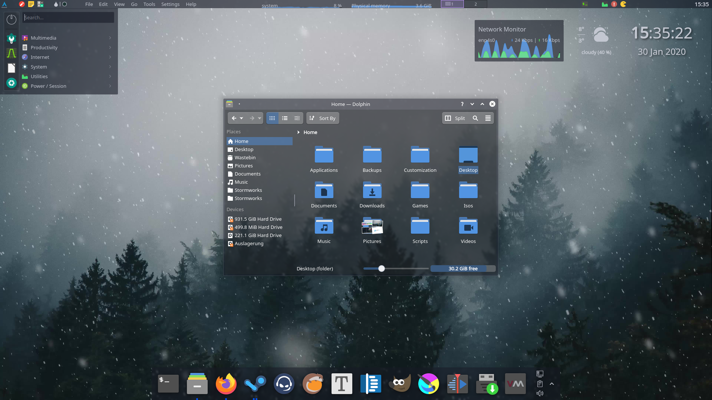

# Glassy
## A minimalistic theme for KDE Plasma 

  (Icons: [Papirus](https://github.com/PapirusDevelopmentTeam/papirus-icon-theme))

### Suggested Settings:

Kvantum theme: Glassy

Colors: Glassy

Aurorae theme (window decorations): Glassy

Konsole colors: Glassy

Icons: Papirus

> Enable slight background blur in desktop effects to improve readability

### Credits
> This theme is based on [Sweet](https://store.kde.org/p/1294174).

> Contains icons from [Nilium](https://www.pling.com/p/1226329/).

> Contains rounded backgrounds from [varlesh](https://github.com/varlesh/rounded).

> Aurorae theme based on [Freeze](https://store.kde.org/p/1002663/).
