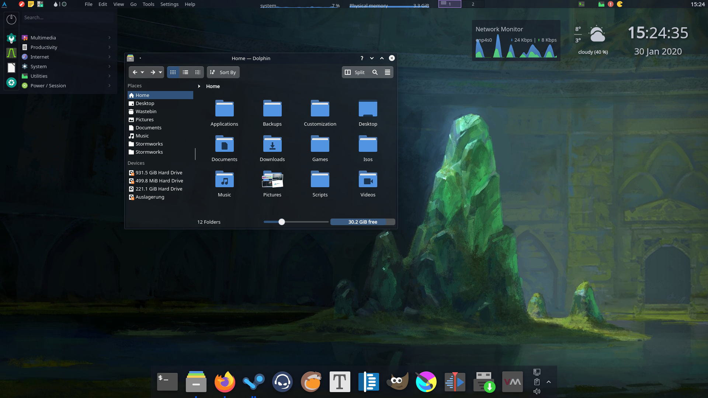

# Glassy
## A minimalistic theme for KDE Plasma 

  (Icons: [Papirus](https://github.com/PapirusDevelopmentTeam/papirus-icon-theme))

### Credits
> This theme is based on the [Sweet](https://store.kde.org/p/1294174) theme.

> Contains Icons from the [Nilium](https://www.pling.com/p/1226329/) theme.

### License
This theme is licensed under [CC BY-SA.](https://creativecommons.org/licenses/by-sa/4.0/)
