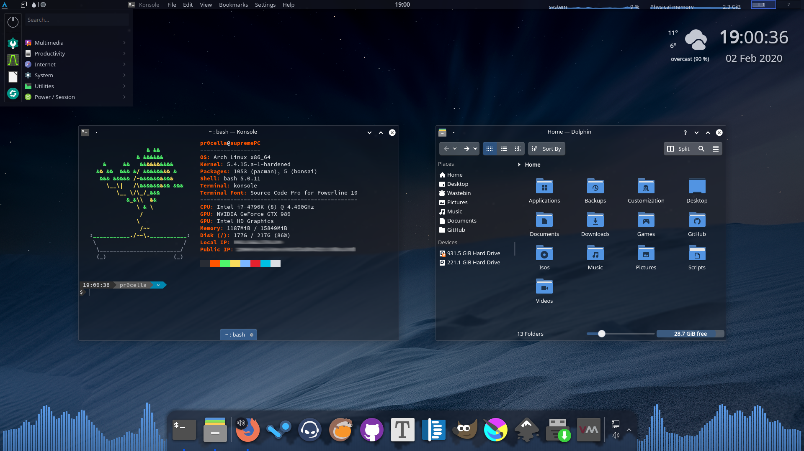

# Glassy
## A minimalistic theme for KDE Plasma 

​																			  (Sharp)

​																			(Rounded) 

### Suggestions:

Apps: [LatteDock](https://github.com/KDE/latte-dock), [GLava](https://github.com/jarcode-foss/glava)

Icons: [Papirus](https://github.com/PapirusDevelopmentTeam/papirus-icon-theme)

Terminal Font: Source Code Pro

> Kvantum is required for transparent window backgrounds

> Enable slight background blur in desktop effects to improve readability

### [KDE-Store collection](https://www.pling.com/c/1356013/)

### Credits
[Wallpaper by Charlie Henson](https://www.pling.com/p/1310882/)

> Contains icons from [Nilium](https://github.com/mcder3/Nilium-Plasma-Theme)

> Rounded borders based on [rounded](https://github.com/varlesh/rounded)

> Aurorae theme based on [Freeze](https://store.kde.org/p/1002663/)

> Color scheme based on [Arc](https://github.com/PapirusDevelopmentTeam/arc-kde)

> Kvantum theme based on [KvGlass](https://store.kde.org/p/1201321/)

Individual licenses may apply

